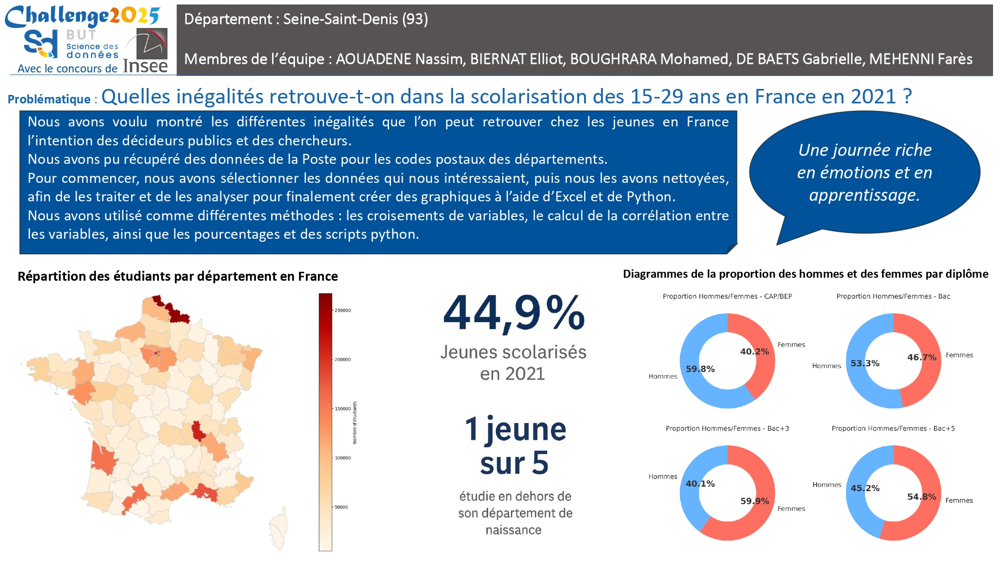
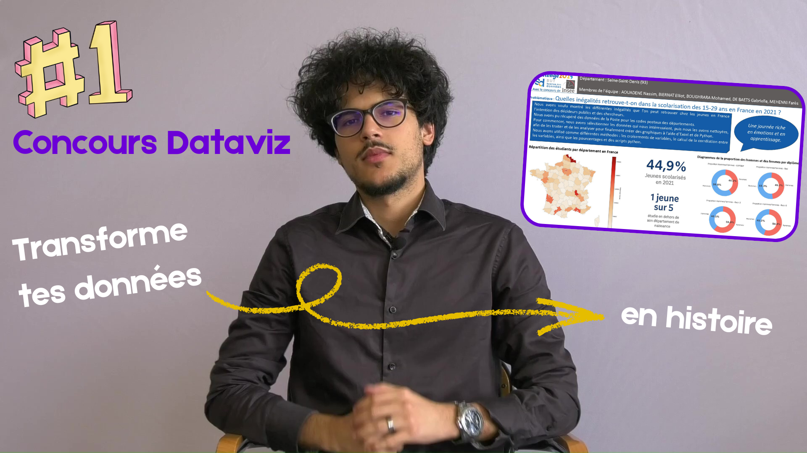

# 📊 Concours DATAVIZ 2025 

🏆 **1ʳᵉ place au niveau de l’IUT de Villetaneuse** – Université Sorbonne Paris Nord

## Inégalités de scolarisation des 15–29 ans en France (2021)

 
## 🎥 Lien vidéo explicative (vulgariser la data)
🔗 [Voir la vidéo sur YouTube](https://youtu.be/wFg_cp123pA)

 
> 📰 **Format original**  
> La vidéo explicative adopte le format d’un journal d’actualité, combinant rigueur analytique et ton pédagogique, afin de rendre la restitution des résultats plus claire, engageante et accessible.
 

## Contexte
En collaboration avec l’**INSEE**, ce projet a été réalisé dans le cadre du **Concours National de Datavisualisation 2025**, organisé au sein des départements Science des Données de ***tous** les IUT de France*.  
Les participants disposaient uniquement de **données brutes**, sans problématique imposée, et devaient conduire l’ensemble de la démarche analytique de manière autonome.

 
> ❗ **Remarque**
> *Ce projet repose sur une forte capacité d’**analyse exploratoire des données (EDA)** et d’**interprétation des données brutes afin d’en extraire des insights exploitables**.*
 

---

## 🧠 Compétences mobilisées
- Analyse exploratoire des données (EDA)
- Nettoyage et structuration de données
- Visualisation et storytelling de la donnée
- Analyse territoriale
- Travail en équipe et communication des résultats

---

## 🎯 Notre objectif
Nous avons choisi de travailler sur les **données de 2021**, car elles sont les plus récentes et permettent d’analyser des enjeux sociaux actuels.
Notre équipe visait à analyser les **inégalités de scolarisation des jeunes de 15 à 29 ans en France**, en mettant en évidence les disparités territoriales et sociales.  
Il s’adresse principalement aux **décideurs publics, chercheurs et acteurs de l’éducation**, afin de proposer une lecture claire et synthétique de phénomènes complexes à partir de données publiques.

---

## ❓ Problématique
**Quelles inégalités observe-t-on dans la scolarisation des 15–29 ans en France en 2021, selon les territoires, le sexe et le niveau de diplôme ?**

---

## 🛠️ Outils utilisés
- **Excel** (préparation, TCD)
- **Tableau** & **Power BI** (exploration visuelle)
- **Python** (`pandas`, `geopandas`, `matplotlib`)
- **PowerPoint** (regroupement et mise en forme finale des graphiques, structuration du storytelling, rédaction des éléments descriptifs, production de l’infographie finale)

---

## 🔍 Méthodologie
- Sélection et **extraction des colonnes pertinentes** depuis la base brute INSEE  
- Création d’un **fichier Excel dédié** (dossier *données traitées*) avec des variables hiérarchisées pour faciliter l’analyse  
- Analyse exploratoire avec **Excel** (TCD), **Tableau** et **Power BI**  
- Analyses et visualisations avancées avec **Python** (`pandas`, `geopandas`, `matplotlib`)  
- Fusion avec des données géographiques (**GeoJSON**) pour produire une **carte choroplèthe**  
- Regroupement des visualisations et rédaction des commentaires dans une **infographie finale réalisée sous PowerPoint**
  
---

## 📈 Résultats clés  
- **1 jeune sur 5** étudie en dehors de son département de naissance
- **44,9 %** des jeunes de 15–29 ans sont scolarisés en 2021
- Fortes **disparités territoriales**  
- Différences marquées selon le **sexe** et le **niveau de diplôme**

---

## 🖼️ Infographie finale
Synthèse visuelle des analyses et résultats du projet.

👉 Cliquez sur l’image pour ouvrir l’infographie complète (PDF)

---

## 👥 Équipe
- AOUADENE Nassim
- BIERNAT Elliot
- BOUGHRARA Mohamed (@mohamedb178)
- DE BAETS Gabrielle 
- MEHENNI Farès

---

## Conclusion
Ce projet illustre une démarche complète de **data analysis**, depuis l’exploration de données brutes jusqu’à la restitution visuelle, en mobilisant des compétences clés : **analyse exploratoire, visualisation, storytelling et travail en équipe**.

 
👉 **Cliquez** pour voir la présentation des résultats sous forme de **journal d’actualité**, illustrant la capacité à communiquer les résultats.
